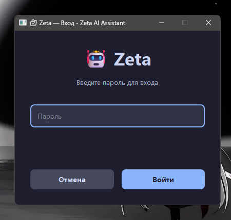
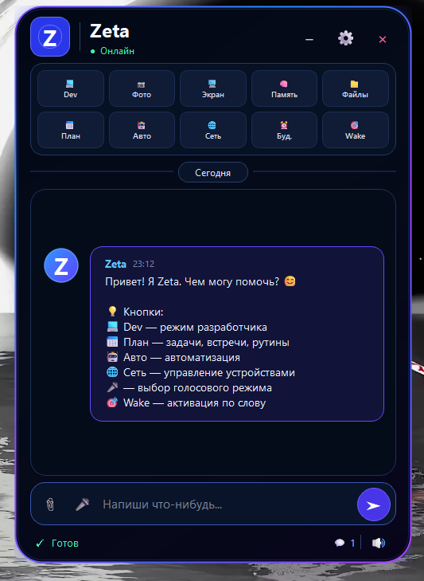
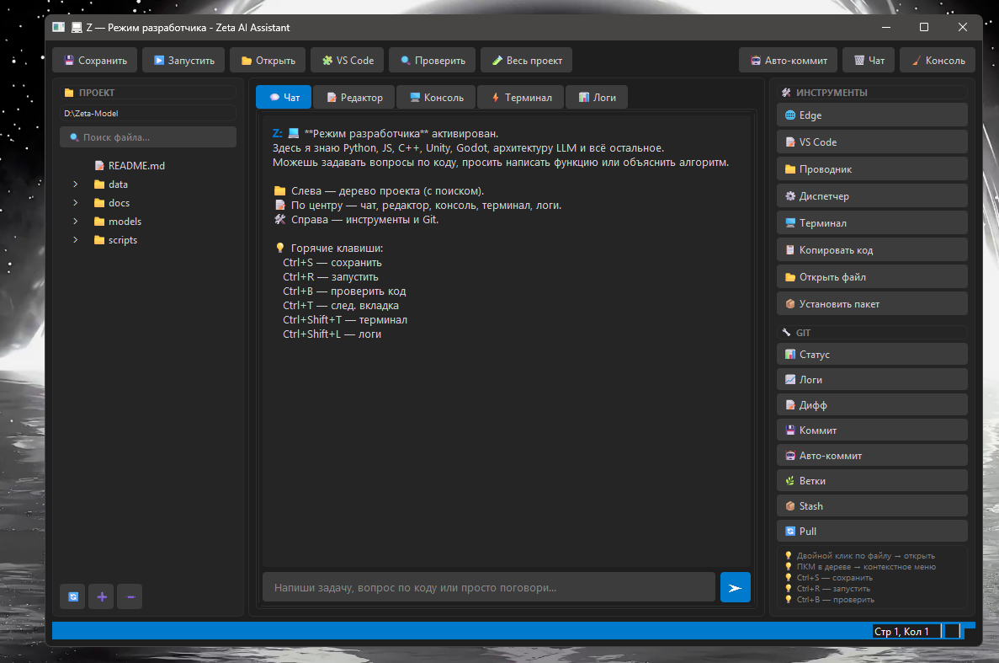
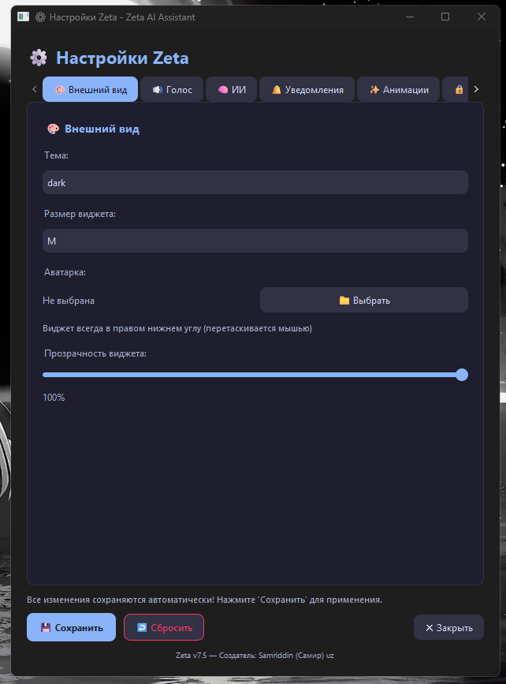

<div align="center">

# 🤖 Zeta — Локальный ИИ-ассистент

**Полностью локальный, бесплатный ИИ-ассистент для Windows с характером, голосом, зрением и управлением ПК.**

[](https://python.org)
[](https://pypi.org/project/PyQt6/)
[](https://ollama.ai)
[](LICENSE)
[](https://github.com/samriddin)

**Создан в Узбекистане 🇺🇿 17-летним разработчиком**

</div>

---

## ✨ Возможности

| # | Функция | Описание |
|---|---------|----------|
| 🧠 | **Чат** | zeta-universal (llama3.1:8b) с характером V из Murder Drones |
| 👁️ | **Зрение** | LLaVA 13B — анализ фото и скриншотов |
| 🎤 | **Голос** | TTS (6 нейронных голосов) + STT (распознавание речи) |
| 🎯 | **Wake Word** | Активация по «Hey Jarvis» |
| 💻 | **Управление ПК** | Приложения, громкость, питание, буфер, IP |
| 🌐 | **Браузер** | 100+ сайтов, закладки, вкладки, поиск в 5 поисковиках |
| 📱 | **Telegram-боты** | Личный (управление ПК) + публичный (для всех) |
| 🌐 | **Веб-интерфейс** | Работает на телефоне (скоро PWA) |
| 📅 | **Планировщик** | Задачи, встречи, рутины |
| 🤖 | **Автоматизация** | Правила триггер→действие (CPU, время, дни недели) |
| 🌐 | **Устройства** | Управление ПК по LAN (скриншоты, файлы, WOL) |
| 📄 | **RAG** | Читает PDF, Word, Excel, TXT, CSV |
| 🎮 | **Git** | Статус, коммит, авто-коммит |
| 🔒 | **Безопасность** | AES-256, bcrypt, IDS, аудит, бэкапы |

---

## 📸 Скриншоты

### 🤖 Главный виджет



### 💻 Режим разработчика (IDE)



### ⚙️ Настройки



### 🌐 Веб-интерфейс



> 💡 Положи свои скриншоты в папку `docs/` и они появятся здесь

---

## 🚀 Установка

### 1. Требования

- **Windows 10/11**
- **Python 3.12+** — [скачать](https://www.python.org/downloads/)
- **Ollama** — [скачать](https://ollama.ai/)
- **8+ ГБ RAM** (16+ для комфорта)

### 2. Клонирование

```bash
git clone https://github.com/ТВОЙ_НИК/zeta.git
cd zeta